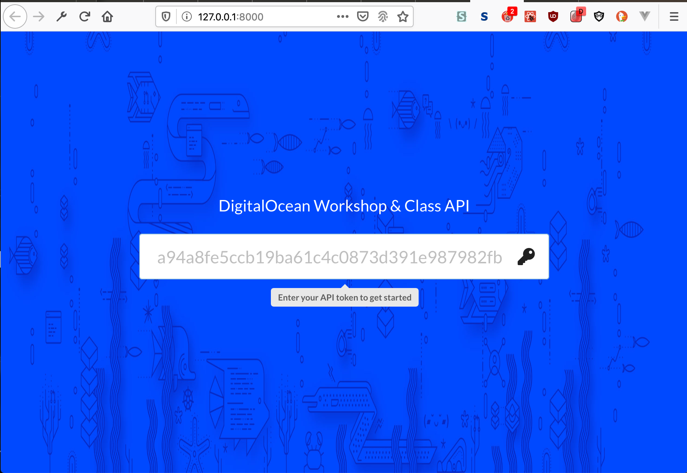
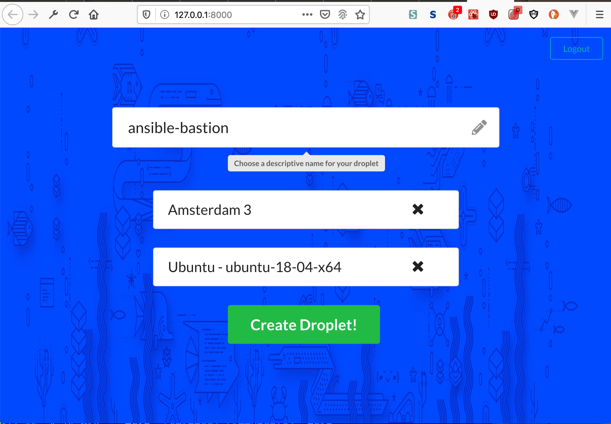

# Purpose
Current limitations of the DO UI and IAM pose issues to educators trying to use
DO in the classroom. This tool aims to be an API Proxy between the DO
Infrastructure and students to give the teacher/professor more control of the 
resources students use.

## This is in Development/Alpha phase and has no guarantee to work

## Dev Notes
* Run `export $(grep -v '^#' env | xargs)` to set env vars from an env file

### Getting Started with Development
1. Create a Python virtual environment in your home directory `python3 -m venv ~/do-classroom`
2. Activate the environment `source ~/do-classroom/bin/activate`
3. Install Python requirements `pip install -r do_classroom/requirements.txt`
4. Create an `env` file for environment variables as shown in `env.example`
    * Add a DigitalOcean API key to the file as `DO_TOKEN`
    * Generate a secret key using `python generate_secret_key.py` and add it to the env file as DJANGO_SECRET_KEY
    * If you plan on accessing from an IP address or DNS name that isn't localhost add that to DJANGO_ALLOWED_HOSTS
5. Export the env vars `export $(grep -v '^#' env | xargs)`
6. Setup DB by making migrations `python do_classroom/manage.py migrate`
7. Create a superuser for testing `python do_classroom/manage.py createsuperuser`
8. Run the server `python do_classroom/manage.py runserver 0.0.0.0:8000`

# Issues this solves
* Removes the need for every student to have an account to use the resources
   * Collegiate - Not all students have credit cards. This could be a barrier
   * Primary to Secondary School - Age requirements to legally be able to create
   a contract, hence a DO account. 
* Allows for resource restrictions on accounts.

# Proposed Workflow
1. Professor/teacher creates DO account, inputs institution/personal card, 
and generates API token (can potentially be given credits)
2. Professor/teacher spins up API proxy via Marketplace one click
3. Professor/teacher creates student accounts. Can be CSV import
4. Professor/teacher sets up rules determining resource constraints. E.g. Can
only spin up a $5 droplet, has to be Fedora, only one droplet per student
5. Student is emailed from app with username and password. Student logs in and
changes password. Uploads SSH key
6. Student generates API Proxy token (possibly? Do we want this?)
7. Student can either make API request or spin up droplet from Proxy API UI
8. Jamon mentioned something like tty.js or something for a better terminal 
experience in the browser.

# Spec
* For now, just use Django Admin for portal
* nginx for proxying to app
* github.internal project using Python image
* Two roles, Admin/Teach & Student
   * Admin/Teacher role
       * Full droplet admin
       * Change API key
       * Create Student users (might want to write CSV uploader for)
       * Create API token
       * Set policy on student access
    * Student role
       * Spin up and delete droplet 
       * Create API token for REST
* Create full REST API for complete functionality
* Option to secure with Let’s Encrypt or self signed cert
* Setup droplet username and password
    * Use student password from django admin?
    * Let professor set username & password?
* Docker container for local support and Marketplace image
* Swagger documentation
* v2
    * Configure via Ansible
    * Oauth support?
  

